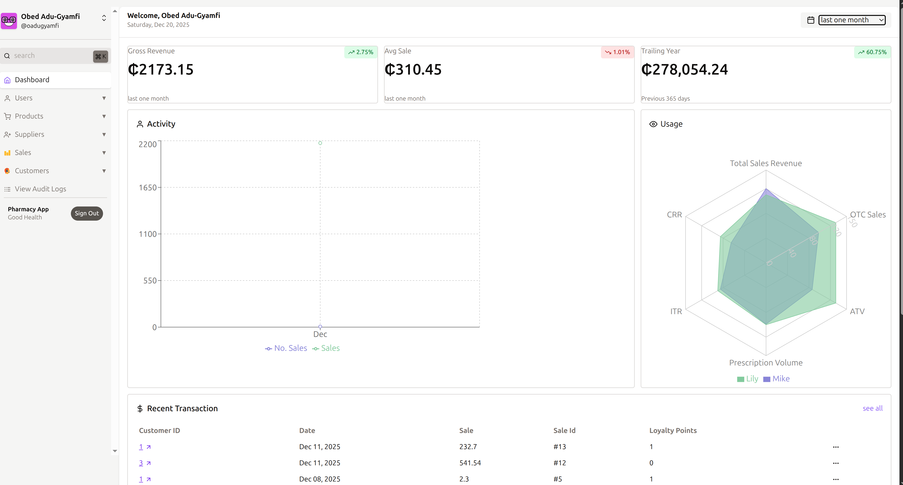

<h1 align="center">Pharmacy App</h1>
<p align="center">A modern pharmacy management system for inventory, sales, and reporting.</p>


## 🚀 Overview

Pharmacy App provides POS, inventory tracking, supplier  management, customer records, and sales analytics with role-based access.

## 🧩 Features

- POS checkout and sales recording
- Product and stock batch management
- Suppliers and purchase orders
- Customers and activity tracking
- Sales reports by period
- Role-based access (admin, pharmacist, cashier)

## 🖥️ Tech Stack

**Frontend**

- React + Vite
- Tailwind CSS
- TypeScript

**Backend**

- FastAPI
- SQLAlchemy
- MySQL (via `PyMySQL`)

**DevOps**

- Docker & Docker Compose
- Git

## 🔑 Environment Variables

Create a `.env` in the project root. See `.env.example` for a template.

```env
# Database Configuration (MySQL)
DB_HOST=mysql-db        # use "mysql-db" when using Docker Compose
DB_PORT=3306            # MySQL port inside the container
DB_NAME=Pharmacy
DB_USER=your_mysql_user
DB_PASSWORD=your_mysql_password

# Application Configuration
SECRET_KEY=change_me    # required for JWT
```

Notes:

- The backend reads `SECRET_KEY` (not `SECRETE_KEY`).
- When running without Docker, set `DB_HOST=localhost` and `DB_PORT=3306` (or your local MySQL port).
- With Docker Compose, the backend container connects to MySQL at `mysql-db:3306`.

## 🧪 API Docs

Once the backend is running, interactive docs are available at:

- Swagger UI: http://localhost:8000/docs
- ReDoc: http://localhost:8000/redoc

## 🧰 Getting Started (Local, no Docker)

Prerequisites:

- Python 3.12
- Node.js 18+ and npm
- MySQL 8 (running locally)

Setup and run:

```bash
# 1) Clone and configure env
git clone https://www.github.com/obedAdu-Gyamfi/pharmacy-app.git
cd pharmacy-app
cp .env.example .env
# edit .env with your local MySQL credentials

# 2) Backend: create venv and install deps
python3 -m venv .venv
source .venv/bin/activate
pip install --upgrade pip
pip install -r app/requirements.txt

# 3) Start backend (FastAPI with Uvicorn)
python3 app/main.py
# or
uvicorn app.main:app --host 127.0.0.1 --port 8000 --reload

# 4) Frontend: install and run
cd pharmacy-ui
npm install
npm run dev
```

Frontend dev server runs on http://localhost:5173 and expects the backend at http://localhost:8000.

## 🐳 Run with Docker Compose

Use the provided `docker-compose.yml` to run backend, database, and frontend together.

```bash
# 1) Prepare env
cp .env.example .env
# Adjust values if needed (compose uses MySQL with DB_HOST=mysql-db)

# 2) Build and start services
docker compose up --build -d

# 3) View logs (optional)
docker compose logs -f

# 4) Stop
docker compose down
```

Services and ports:

- Backend (FastAPI): http://localhost:8000
- Frontend (Vite): http://localhost:5173
- MySQL: localhost:3307 (host port mapped to container `3306`)

## 🔒 Default Admin User

On first run, the system creates a default admin user:

- username: `admin`
- password: `admin123`

Change this password immediately in production.

## 🧰 Useful Commands

Frontend (`pharmacy-ui`):

- `npm run dev` — start dev server
- `npm run build` — production build
- `npm run preview` — preview production build
- `npm run lint` — run ESLint

Backend (`app`):

- `pip install -r app/requirements.txt` — install dependencies
- `uvicorn app.main:app --reload` — run dev server

## 🛠️ Troubleshooting

- MySQL connection refused: verify `DB_HOST`, `DB_PORT`, credentials, and that MySQL is running.
- `SECRET_KEY` missing: set `SECRET_KEY` in `.env` (required for JWT auth).
- Port conflicts: change exposed ports in `docker-compose.yml` or local processes.
- CORS issues: update `allow_origins` in backend if needed.

## 📁 Project Structure (key paths)

- Backend: `app/` (FastAPI app, models, Dockerfile)
- Frontend: `pharmacy-ui/` (React + Vite + Tailwind)
- Compose: `docker-compose.yml`
- SQL schema: `sql/schema.sql`

## 👨 Author

**Obed Adu-Gyamfi**  
software engineer  | mathematics enthusiast  
- **Github:** [https://github.com/obedAdu-Gyamfi](https://github.com/obedAdu-Gyamfi)  
- **LinkedIn:** [https://www.linkedin.com/in/obedadu-gyamfi](https://www.linkedin.com/in/obedadu-gyamfi)  
- **Email:** [adugyamfiobed.tpp3@gmail.com](adugyamfiobed.tpp3@gmail.com)  
- **Location: Ghana**

***
